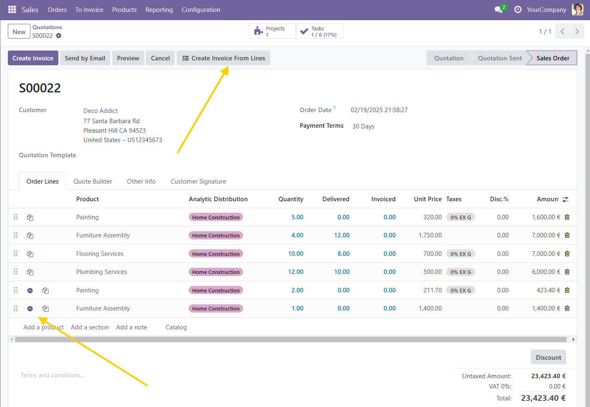

## Odoo addons Examples. 

	Small addons examples of Python programming with the Odoo ERP framework.
    You will need to install Odoo 18.0 to use these examples.

	version: 18.0.1.0.0
    release: v18.1.0.0
	author: Joan A. Pinol
	author_nickname: japinol
	author_gitHub: japinol7
	author_twitter: @japinol
	Python: 3.13
	PostgreSQL v. tested: 18.1

## Older versions

    You can find these addons for Odoo 17.0 in the release: v17.0.1.0
    You can find these addons for Odoo 16.0 in the release: v16.0.1.0

## Odoo new addon: JAP Sales

### New Features

* Duplicate a sale line with the duplication button   on the right side of the line.
  * Only visible for user with group: Sale Duplicate Lines.
  * Users with the group 'Role Sales Squad' inherit this group.

* Duplicated lines will be marked with this icon on the most important views:   
  * One letter A within a solid circle. 

* Create an Invoice from Selected Sale Lines.
  * Only visible for user with group: Role Sales Squad.
  * You can select which lines to invoice.
  * You can also add an Invoice note that will be added to the created invoice.

* Display a list of all sales orders associated with the customer of the current order.
    * You can see all the orders on this list. 
    * But you can only open an order if you have the right permissions.
 

### New icons in order lines

Icon mark to duplicate an order line  
  

Icon mark to show which lines are duplicated with this feature  
  

### How it works

Install (Activate) this addon modules: 
* JAP Sales
* JAP Customize Version
 

Note: The following addon modules will be automatically installed:
* JAP Addons Config
* JAP Security
 

    

Activate the 'Role Sales Squad' role for the chosen users    
    

A Sale or quotation will show a duplicate button for each line  
and an icon mark for a line created by duplication    
    

Wizard that opens with the button 'Create Invoice from Lines'  
You can select which lines to add to the new invoice and add an internal note.    
    

Invoice created with the Wizard 'Create Invoice from Selected Lines'    
    

Wizard that opens with the button 'Sale orders with the same customer'  
It displays a list of all sales orders associated with the customer of the current order.  
You can open a sale order from this wizard only if you have the right permissions.   
    

.
